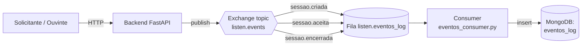

# Catálogo de Eventos — Sprint 2

O backend publica eventos de domínio em um **exchange topic** do RabbitMQ
chamado `listen.events`. O nome do evento é usado como **routing key**,
permitindo que consumers façam bind por evento específico
(`sessao.criada`) ou por padrão (`sessao.*`).

## Configuração do MOM

| Item | Valor |
|------|-------|
| Broker | RabbitMQ 3.13 |
| Exchange | `listen.events` |
| Tipo | `topic`, durável |
| Fila do consumer de log | `listen.eventos_log` (bind em `sessao.*`) |
| Formato da mensagem | JSON, `delivery_mode=PERSISTENT` |

## Envelope das mensagens

Todo evento é publicado com a mesma estrutura externa:

```json
{
  "evento": "<nome do evento, igual à routing key>",
  "ocorrido_em": "<timestamp ISO-8601 UTC>",
  "data": { ... payload específico ... }
}
```

## Eventos publicados

| Evento (routing key) | Produtor | Consumidor | Disparado em |
|----------------------|----------|------------|--------------|
| `sessao.criada` | `CriarSessaoUseCase` | `listen.eventos_log` (e futuramente app do ouvinte) | Solicitante abre uma nova sessão |
| `sessao.aceita` | `AtualizarStatusSessaoUseCase` | `listen.eventos_log` (e futuramente app do solicitante) | Ouvinte aceita uma sessão pendente |
| `sessao.encerrada` | `AtualizarStatusSessaoUseCase` | `listen.eventos_log` (e futuramente app do solicitante) | Sessão atinge `concluida` ou `cancelada` |

### `sessao.criada`

```json
{
  "evento": "sessao.criada",
  "ocorrido_em": "2026-05-20T18:42:11.103+00:00",
  "data": {
    "sessao_id": "665a1b...",
    "solicitante_id": "665a19...",
    "descricao": "Estou ansioso e gostaria de conversar."
  }
}
```

### `sessao.aceita`

```json
{
  "evento": "sessao.aceita",
  "ocorrido_em": "2026-05-20T18:45:02.778+00:00",
  "data": {
    "sessao_id": "665a1b...",
    "solicitante_id": "665a19...",
    "ouvinte_id": "665a1a..."
  }
}
```

### `sessao.encerrada`

```json
{
  "evento": "sessao.encerrada",
  "ocorrido_em": "2026-05-20T19:10:55.000+00:00",
  "data": {
    "sessao_id": "665a1b...",
    "solicitante_id": "665a19...",
    "ouvinte_id": "665a1a...",
    "status_final": "concluida"
  }
}
```

## Fluxo



O backend **não conhece** o consumer: ele apenas publica no exchange. O
consumer roda como processo separado (container `listen-consumer`) e
processa as mensagens fora do ciclo HTTP, evidenciando assincronicidade.
